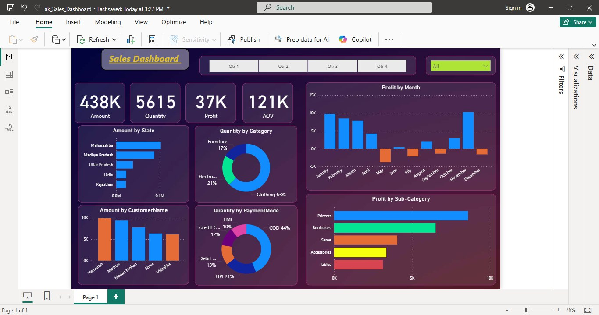

---

# 📊 Sales Analytics Dashboard (Power BI)

## 📌 Overview

This project is an interactive **Sales Analytics Dashboard** created using **Power BI** to analyze and visualize business performance. It provides insights into sales amount, quantity, profit, and customer behavior across different regions, categories, and time periods.

The dashboard is designed for quick decision-making by presenting key metrics and trends in a visually appealing and easy-to-understand format.

---

## 🎯 Key Features

### 1. 📈 KPI Cards

At the top of the dashboard, you’ll find four key performance indicators:

* **Amount:** Total sales revenue (438K)
* **Quantity:** Total units sold (5615)
* **Profit:** Total profit generated (37K)
* **AOV (Average Order Value):** Average revenue per order (121K)

These KPIs give a quick snapshot of overall performance.

---

### 2. 🗓️ Quarter Filter (Slicer)

* A **quarter-wise filter (Qtr 1 – Qtr 4)** allows users to dynamically analyze data for specific time periods.
* Selecting a quarter updates all visuals on the dashboard.

---

### 3. 📊 Profit by Month (Bar Chart)

* Displays monthly profit trends.
* Positive profits are shown in one color (blue), while losses are shown in another (orange).
* Helps identify:

  * High-performing months
  * Loss-making periods

---

### 4. 🌍 Amount by State (Horizontal Bar Chart)

* Shows sales distribution across states.
* Example states:

  * Maharashtra
  * Madhya Pradesh
  * Uttar Pradesh
  * Delhi
  * Rajasthan
* Helps identify top-performing regions.

---

### 5. 🧩 Quantity by Category (Donut Chart)

* Breaks down sales quantity by product category:

  * Clothing (63%)
  * Electronics (21%)
  * Furniture (17%)
* Useful for understanding which category drives the most sales volume.

---

### 6. 👥 Amount by Customer Name (Bar Chart)

* Displays top customers based on purchase amount.
* Helps identify:

  * High-value customers
  * Customer contribution to revenue

---

### 7. 💳 Quantity by Payment Mode (Donut Chart)

* Shows how customers prefer to pay:

  * COD (44%)
  * UPI (21%)
  * Debit Card (13%)
  * Credit Card (12%)
  * EMI (10%)
* Useful for optimizing payment strategies.

---

### 8. 📦 Profit by Sub-Category (Bar Chart)

* Displays profit contribution by product sub-categories:

  * Printers
  * Bookcases
  * Saree
  * Accessories
  * Tables
* Helps identify:

  * Most profitable products
  * Underperforming segments

---

## 🎨 Design Highlights

* Dark-themed UI with vibrant accent colors for better readability
* Consistent layout with grouped visuals
* Interactive elements (filters, slicers)
* Clean and modern dashboard design

---

## 🛠️ Tools & Technologies

* **Tool Used:** Microsoft Power BI
* **Data Processing:** Power Query (for transformation & cleaning)
* **Data Modeling:** Relationships between tables
* **Visualization:** Built-in Power BI charts and custom formatting

---

## 📂 Project Structure

```
📁 Sales-Dashboard
 ┣ 📄 Sales_Dashboard.pbix   # Main Power BI file
 ┣ 📄 README.md              # Project documentation
 ┗ 📁 Dataset                # Source data 
 ┗ 📁 Assets                 # O/p images, videos, GIFs
```

---

## 🚀 How to Use

1. Download or clone this repository:

   ```bash
   git clone https://github.com/ashishkumarak/Sales-Analytics-Dashboard-using-Power-BI.git
   ```

2. Open the `.pbix` file in **Power BI Desktop**

3. Interact with:

   * Quarter slicer
   * Charts and visuals

4. Modify or extend the dashboard as needed.

---

## 📊 Use Cases

* Business performance tracking
* Sales trend analysis
* Customer behavior insights
* Regional sales comparison
* Product profitability analysis

---

## 🔮 Future Improvements

* Add year-wise comparison
* Include forecasting (using Power BI analytics tools)
* Add drill-through reports
* Integrate real-time data sources


---

## 📸 Output Showcase

### 🖼️ Screenshots

```markdown

| Dashboard |  |

```

---

### 🎬 GIF 

```markdown


```

---

## 🤝 Contributing

Contributions are welcome! Feel free to fork this repository and submit a pull request.

---

## 📜 License

This project is open-source and available under the MIT License.

---

